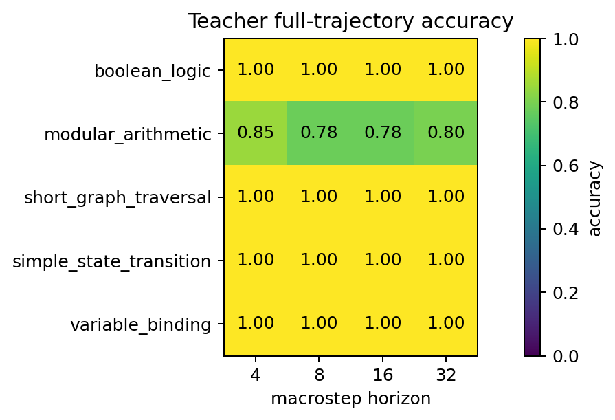
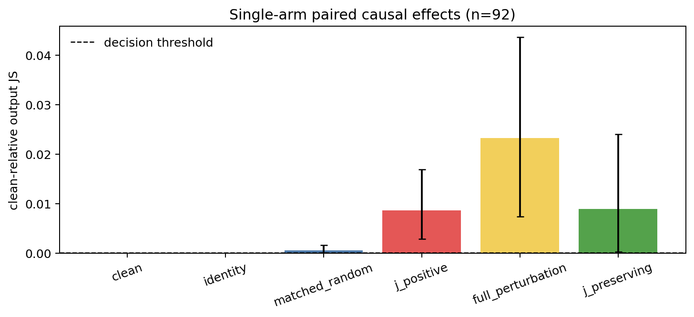
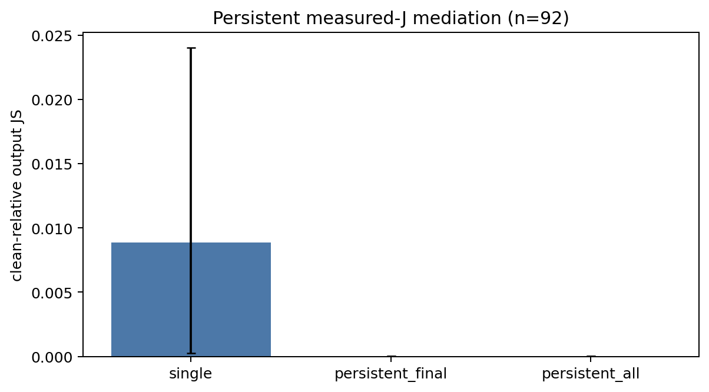
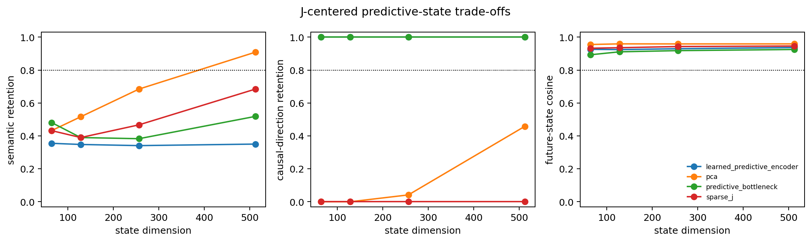
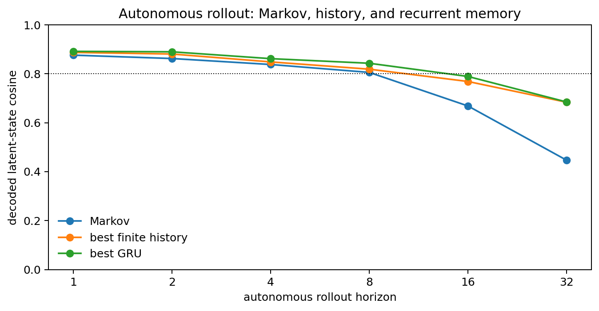
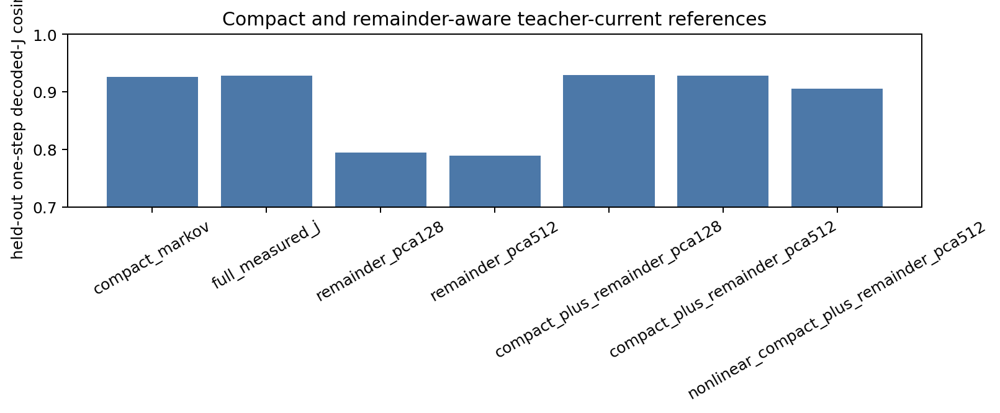

# Final report

> **Protocol v4 provides exploratory causal evidence for H2: the instantaneous measured-J state is insufficient, while later measured-J restoration removes the detected effect. No compact controller or H3 claim is established.**

## Material Passport

- Protocol: `phase0_protocol_v2` (frozen before fresh confirmation)
- Phase 0 v2 gate: **PASSED**
- Closure-layer calibration gate: **FAILED**
- Historical v2 downstream status: **causal closure gated; compact-memory exploratory execution complete**
- Historical v2 conclusion: **D — J measurement is validated, but the paired causal restoration and compact-controller criteria are not satisfied**

This report makes no claim about consciousness or extraction of a model's “true
thoughts.” “Measured-J component” and “measured-J remainder” refer only to the
declared finite dictionaries and sparse decomposition.

## Verified measurement results

Fresh official-compatible pass@10 was 0.775862 for multihop (58 items) and 0.716797 for order of operations (256 items). The item-clustered MRR advantage was 0.135202, 95% CI [0.109490, 0.161532]. At frozen layer 24, the intended-answer log-odds effect was 3.064270, 95% CI [1.978771, 4.221590], above the 0.0001 null envelope.

Independent closure-layer calibration then tested layers 23, 24, 25, 26, 27, 28, 29. It obtained 0/1400 strictly valid clamp trials; the best layer-level valid rate was 0.000, below the frozen 0.80 requirement. All candidate layers therefore failed only the clamp-valid-rate criterion, and the eligible set is empty.

The v2 Phase 0 result is statistically positive and practically above its frozen readout
thresholds. It does not supersede the independent causal-state gate. Strict-all-layers
hit@10 remains a sensitivity analysis, not the v2 primary statistic.

## Historical v2 adjudication (preserved)

1. **Did the fresh Phase 0 readout gate pass?** Yes. The exact pass@10 and confidence intervals are reported above.
2. **Was a lens-quality band identified?** Yes: block-output layers 20–30, selected from calibration only.
3. **Did any layer become closure eligible?** No. Layers 23–29 passed readout, rank, positive-control, numerical, and repeatability checks, but each had 0/200 strictly valid clamps.
4. **Is instantaneous measured-J approximately Markov sufficient?** Undetermined; no gate-authorized closure trial was run.
5. **Does measured-J remainder causally influence future measured-J?** Undetermined; calibration failure prevents a causal estimate.
6. **Is any influence mediated by later measured-J writes?** Undetermined; one-shot, final-persistent, and all-position-persistent mediation arms were gated.
7. **Did final-token and sequence-state arms agree?** Not tested. Their scope hooks are implemented and tested, but neither arm produced empirical effects.
8. **Does E_R decrease as dictionary size grows from 4,096 to 16,384?** Not tested. Nested dictionaries were built, but no common-valid paired Phase 3 trials exist.
9. **Do natural collisions reproduce a remainder association?** Not tested; no observational collision bank was built after the layer gate failed.
10. **Can short layer-depth J history close the oracle gap?** Not tested.
11. **Can token-time J plus compact recurrent memory close the gap?** Not tested.
12. **What is the smallest stable autonomous controller?** None established; controller training was gated.
13. **Does a controller generalize to unseen procedural tasks?** Not tested.
14. **Does external knowledge restore knowledge-heavy performance?** Not tested.
15. **Was teacher/student latent-intervention fidelity demonstrated?** No; Phase 6B was not executed.

## Evidence by type

- **Intervention evidence:** the Phase 0 J-coordinate positive control passed. No valid Phase 3 causal intervention exists.
- **Observational evidence:** no v2 natural-collision result exists.
- **Statistical evidence:** the readout and positive-control CIs use 10,000 prompt-clustered bootstrap resamples. No downstream significance test was run.
- **Practical magnitude:** pass@10 and intended-answer log-odds are reported above. E_R, E_J, eta, rollout accuracy, and fidelity are unavailable.

## Interpretation boundary

H1, H2, and H3 remain unresolved. The result is not a negative finding about J-space
closure; it is a failure of the preregistered sparse reconstruction/restoration method to
produce acceptable checkpoint states at any candidate layer. The strongest permitted
classification remains D under all preregistered nearby thresholds used for the formal
gate, because there are no eligible layers and no formal downstream trials.

## Reproducibility

The v1 records and `reports/PHASE0_VALIDATION.md` remain unchanged. The v2 freeze,
fresh records, calibration attempts (including invalid rows), failure manifests, processed
summaries, and figures are committed. Figures 1, 2, 12, and 14 visualize measured data;
the remaining required figures are explicitly machine-sourced gated-status panels, not
quantitative results.

### Recorded downstream commands

- `/data/CSK/J-space-project/jstate-closure/src/jclosure/experiments/validate_lens_v2.py --config configs/phase0_v2_confirmatory.yaml`
- `/data/CSK/J-space-project/jstate-closure/src/jclosure/experiments/calibrate_layers.py --config configs/phase0_v2_confirmatory.yaml`
- `/data/CSK/J-space-project/jstate-closure/src/jclosure/experiments/closure.py --config configs/pilot_v2.yaml --limit 1`
- `/data/CSK/J-space-project/jstate-closure/src/jclosure/experiments/natural_collisions.py --config configs/confirm_v2.yaml --limit 1`
- `/data/CSK/J-space-project/jstate-closure/src/jclosure/experiments/memory_order.py --config configs/confirm_v2.yaml --limit 1 --epochs 1 --budget 1000000`
- `/data/CSK/J-space-project/jstate-closure/src/jclosure/experiments/distill_controller.py --config configs/confirm_v2.yaml --epochs 1`
- `/data/CSK/J-space-project/jstate-closure/src/jclosure/experiments/dictionary_sensitivity.py --config configs/confirm_v2.yaml`
- `/data/CSK/J-space-project/jstate-closure/src/jclosure/experiments/token_time_closure.py --config configs/confirm_v2.yaml --limit 1`
- `/data/CSK/J-space-project/jstate-closure/src/jclosure/experiments/modularity.py --config configs/confirm_v2.yaml`

## Exploratory protocol v3 update

The v1/v2 records, thresholds, reports, and 0/1400 calibration result remain
byte-identical under the committed SHA-256 regression guard.

- Geometry status: **COMPLETED**
- Pareto status: **COMPLETED**
- V3 clamp calibration: **COMPLETED**
- Behavioral protocols authorized: **none**
- Low-dimensional search: **COMPLETED_NOT_AUTHORIZED**
- Token-time/controller: **GATED**
- Strongest warranted classification after v3: **D**

Dense state-definition feasibility warning: the median local rank at 1e-4 is 2557/2560 and the median tangent-null dimension is 2. The normalized dense profile is therefore operationally near-injective under the frozen rule. This is not compact H1 evidence and triggers low-dimensional search.

The screen used 1536 fit and 1536 audit transitions. Persistence cosine was 0.965006; the remainder oracle reached 0.990099. Candidates closing at least 80% of that gap: 0. Compact state authorized: False.

### Low-dimensional screening

| Candidate | Dimension | next-state cosine | oracle gap closed | reconstruction cosine |
|:---|---:|---:|---:|---:|
| constrained_learned_encoder | 128 | 0.906758 | -2.321267 | 0.260293 |
| constrained_learned_encoder | 256 | 0.963242 | -0.070291 | 0.552953 |
| constrained_learned_encoder | 512 | 0.977593 | 0.501637 | 0.890273 |
| dense_profile_pca | 32 | 0.958106 | -0.274976 | 0.965793 |
| dense_profile_pca | 64 | 0.969552 | 0.181185 | 0.978516 |
| dense_profile_pca | 128 | 0.976989 | 0.477565 | 0.988009 |
| dense_profile_pca | 256 | 0.979518 | 0.578342 | 0.993913 |
| dense_profile_pca | 512 | 0.979902 | 0.593644 | 0.997121 |
| deterministic_concept_clusters | 32 | 0.646327 | -12.699936 | n/a |
| deterministic_concept_clusters | 64 | 0.662438 | -12.057873 | n/a |
| deterministic_concept_clusters | 128 | 0.707864 | -10.247574 | n/a |
| deterministic_concept_clusters | 256 | 0.790692 | -6.946730 | n/a |
| deterministic_concept_clusters | 512 | 0.879980 | -3.388437 | n/a |
| predictive_linear_bottleneck | 32 | 0.961607 | -0.135464 | 0.801617 |
| predictive_linear_bottleneck | 64 | 0.972214 | 0.287268 | 0.840998 |
| predictive_linear_bottleneck | 128 | 0.978081 | 0.521048 | 0.901812 |
| predictive_linear_bottleneck | 256 | 0.979743 | 0.587316 | 0.962627 |
| predictive_linear_bottleneck | 512 | 0.979901 | 0.593617 | 0.982223 |
| sparse_active_atoms | 50 | 0.974742 | 0.388009 | n/a |

Failed v3 runs are evidence about execution only and are not interpreted as
model behavior:

- `clamp-v3-calibration-20260830T022757Z-3b3fa742-s20260828`: RuntimeError: clamp calibration shards use different configs
- `geometry-v3-20260828T165452Z-1bf9a00a-s20260828`: OSError: We couldn't connect to 'https://hf-mirror.com' to load the files, and couldn't find them in the cached files.
Check your internet connection or see how to run the library in offline mode at 'https://huggingface.co/docs/transformers/installation#offline-mode'.
- `geometry-v3-20260828T165606Z-1bf9a00a-s20260828`: RuntimeError: Expected a 'cuda' device type for generator but found 'cpu'
- `geometry-v3-20260829T135126Z-1bf9a00a-s20260828-pareto-preflight-001`: KeyboardInterrupt: run cancelled
- `geometry-v3-20260829T143434Z-3b3fa742-s20260828-pareto-shard-000`: KeyboardInterrupt: run cancelled
- `geometry-v3-20260829T143434Z-efb45693-s20260828-pareto-shard-001`: KeyboardInterrupt: parent and shard were explicitly cancelled for a measured performance-path correction before any Pareto part was written
- `geometry-v3-20260829T152136Z-3b3fa742-s20260828-pareto-shard-000`: KeyboardInterrupt: run cancelled
- `geometry-v3-20260829T152136Z-efb45693-s20260828-pareto-shard-001`: KeyboardInterrupt: run cancelled
- `geometry-v3-20260829T153732Z-3b3fa742-s20260828-pareto-shard-000`: KeyboardInterrupt: run cancelled
- `geometry-v3-20260829T153732Z-efb45693-s20260828-pareto-shard-001`: KeyboardInterrupt: run cancelled
- `geometry-v3-20260829T155649Z-3b3fa742-s20260828-pareto-shard-000`: KeyboardInterrupt: run cancelled
- `geometry-v3-20260829T155649Z-efb45693-s20260828-pareto-shard-001`: KeyboardInterrupt: run cancelled
- `geometry-v3-20260829T160152Z-3b3fa742-s20260828-pareto-shard-000`: KeyboardInterrupt: run cancelled
- `geometry-v3-20260829T160152Z-efb45693-s20260828-pareto-shard-001`: KeyboardInterrupt: run cancelled
- `geometry-v3-20260829T163042Z-3b3fa742-s20260828-pareto-shard-000`: KeyboardInterrupt: run cancelled
- `geometry-v3-20260829T163042Z-efb45693-s20260828-pareto-shard-001`: KeyboardInterrupt: run cancelled
- `lowdim-search-v3-20260830T023748Z-3b3fa742-s20260828`: KeyboardInterrupt: run cancelled
- `lowdim-search-v3-20260830T024144Z-3b3fa742-s20260828`: RuntimeError: Phase 3 v3 freeze hash mismatch: [{'path': 'src/jclosure/experiments/lowdim_search.py', 'expected': '7723fbb672a659995b6cacf7edbe4b83e5d6ca82593c7e385b26026ec03e4617', 'observed': 'a281d74a6f925ebd1031ffb80b68eaeb8c5ac0f60a5302494738b4092220bd41'}]

No H1-Dense, H1-Sparse, H2, or H3 claim is permitted unless a frozen operational
state passes calibration and the paired behavioral, mediation, rollout, and
causal-fidelity gates. Small-perturbation records below 0.20 cannot support those
claims.

<!-- V3.1 STATUS START -->
## Protocol v3.1 status

Part A behavioral authorization: GATED.
Part B representation-screen authorization: NOT EVALUATED.
Exact counts, effects, confidence intervals, and attrition are generated in the three v3.1 protocol reports. No classification is upgraded when a required gate is absent.
<!-- V3.1 STATUS END -->

<!-- V3.2 STATUS START -->
## Protocol v3.2 status

Part A behavioral authorization: GATED.
Part B controller execution: COMPLETE.
J measurement remains validated. No H1/H2/H3 classification is upgraded without paired causal restoration and causal-fidelity evidence.
<!-- V3.2 STATUS END -->

<!-- V3.2 POSTRUN START -->
## Protocol v3.2 post-run adjudication

Causal calibration authorized: False. Paired causal base trials: 0.
Compact-memory utility minimum dimension: None.
Strongest warranted classification: **D** unless a later machine record completes every paired causal, autonomous-rollout, and causal-fidelity gate.

### 1. Does a final-token same-J perturbation change the future?

Not estimable without an authorized paired causal pilot.

### 2. How much effect does persistent-final remove?

Not estimable.

### 3. Does persistent-all remove additional effect?

Not estimable.

### 4. Does measured-J act as the main mediation workspace?

Undetermined; no mediation claim is made without a non-null E_single and valid restoration chains.

### 5. Is the current compact J state visibly non-Markov?

No clear non-Markov advantage was observed: the median Markov horizon-8 cosine was 0.852584, versus a best history-run value of 0.850008.

### 6. Does compact recurrent memory improve autonomous rollout?

No tested GRU memory dimension passed the frozen utility gate.

### 7. What is the smallest useful memory dimension?

None established.

### 8. Do teacher imitation and ground-truth accuracy agree?

They are distinct endpoints: across horizon-8 controller summaries, median teacher-action fidelity was 0.189312 and median ground-truth action accuracy was 0.175725; 13 teacher trajectories were teacher-correct.

### 9. Which hypothesis is best supported?

D. Paired causal restoration and causal-fidelity gates are not both complete.

### 10. Is 1M-100M controller scaling warranted next?

No. The frozen recurrent-memory utility gate did not pass.

<!-- V3.2 POSTRUN END -->

<!-- V4 PREDICTIVE STATUS START -->

# Predictive J-state v4 results

> This report is generated from saved protocol-v4 JSON/Parquet records. Dense 4096D measured-J is an operational control, not a compact-state claim.

## Execution status

- Teacher formal set: complete (800 trajectories).
- Single-arm causal pilot: completed run (92/100 target paired base trials).
- Predictive-state screen: complete (16 candidates; 0 passed every retention gate).
- Markov/history/GRU grid: complete (33/33).
- Full/remainder references: complete.
- Persistent mediation: complete.

## Teacher competence

Overall parseable rate was **100.000%**, full-trajectory accuracy **96.000%**, and final-answer accuracy **98.875%**. Primary compact-state analyses use only the 768 fully correct trajectories.

| family                  |   horizon |   n |   parseable rate |   full trajectory accuracy |   final answer accuracy |
|:------------------------|----------:|----:|-----------------:|---------------------------:|------------------------:|
| boolean_logic           |         4 |  40 |            1.000 |                      1.000 |                   1.000 |
| boolean_logic           |         8 |  40 |            1.000 |                      1.000 |                   1.000 |
| boolean_logic           |        16 |  40 |            1.000 |                      1.000 |                   1.000 |
| boolean_logic           |        32 |  40 |            1.000 |                      1.000 |                   1.000 |
| modular_arithmetic      |         4 |  40 |            1.000 |                      0.850 |                   0.850 |
| modular_arithmetic      |         8 |  40 |            1.000 |                      0.775 |                   0.975 |
| modular_arithmetic      |        16 |  40 |            1.000 |                      0.775 |                   0.975 |
| modular_arithmetic      |        32 |  40 |            1.000 |                      0.800 |                   0.975 |
| short_graph_traversal   |         4 |  40 |            1.000 |                      1.000 |                   1.000 |
| short_graph_traversal   |         8 |  40 |            1.000 |                      1.000 |                   1.000 |
| short_graph_traversal   |        16 |  40 |            1.000 |                      1.000 |                   1.000 |
| short_graph_traversal   |        32 |  40 |            1.000 |                      1.000 |                   1.000 |
| simple_state_transition |         4 |  40 |            1.000 |                      1.000 |                   1.000 |
| simple_state_transition |         8 |  40 |            1.000 |                      1.000 |                   1.000 |
| simple_state_transition |        16 |  40 |            1.000 |                      1.000 |                   1.000 |
| simple_state_transition |        32 |  40 |            1.000 |                      1.000 |                   1.000 |
| variable_binding        |         4 |  40 |            1.000 |                      1.000 |                   1.000 |
| variable_binding        |         8 |  40 |            1.000 |                      1.000 |                   1.000 |
| variable_binding        |        16 |  40 |            1.000 |                      1.000 |                   1.000 |
| variable_binding        |        32 |  40 |            1.000 |                      1.000 |                   1.000 |



## Single-arm causal result

The J-preserving arm changed output JS by 0.0088819 (95% CI [0.000261049, 0.0240132]) and future measured-J trajectory by 0.00427375 (95% CI [0.000225727, 0.00926779]). The matched J-positive control changed output JS by 0.00865182 (95% CI [0.00284454, 0.0169416]). The frozen JS decision threshold was 0.0001.

The J-preserving lower confidence bound exceeded the null decision threshold. This is intervention-based evidence that holding current operational measured-J fixed does not fix the future.

The run attempted 191 teacher-correct stepwise prompts; 96 were not correct under the stricter uninterrupted continuation used by this causal endpoint. The pooled result is heterogeneous across families:

| family                  |   n |       JS |   JS lower |   JS upper |   future-J |   future-J lower |   future-J upper |
|:------------------------|----:|---------:|-----------:|-----------:|-----------:|-----------------:|-----------------:|
| boolean_logic           |   7 | 0.033514 |   0.000484 |   0.083476 |   0.037820 |         0.000000 |         0.094521 |
| modular_arithmetic      |  20 | 0.000049 |   0.000021 |   0.000086 |   0.000000 |         0.000000 |         0.000000 |
| short_graph_traversal   |  23 | 0.000054 |   0.000035 |   0.000076 |   0.000000 |         0.000000 |         0.000000 |
| simple_state_transition |  27 | 0.021465 |   0.000064 |   0.063630 |   0.004756 |         0.000000 |         0.013501 |
| variable_binding        |  15 | 0.000050 |   0.000025 |   0.000083 |   0.000001 |         0.000000 |         0.000001 |



## Persistent mediation

Persistent-final output JS was 2.0426e-05 (95% CI [1.43104e-05, 2.75485e-05]); persistent-all was 2.0426e-05 (95% CI [1.43104e-05, 2.75485e-05]). M_final was 0.9977 (95% CI [0.91857, 0.999219]), and M_all was 0.9977 (95% CI [0.918562, 0.999232]). Because this arm perturbs only the final prompt position, causal masking predicts final/all restoration equivalence; it is a hook-scope sanity check, not a sequence-position mediation test.
Restoring measured-J at later workspace layers removed approximately 99.77% of the single-arm JS effect, and the residual JS fell below the 1e-4 decision threshold. For this final-position arm, the best-supported pathway is measured-J remainder → later measured-J writes → future, rather than a detectable measured-J bypass.



## Compact-state Pareto screen

No fully gated compact state was found.
For exploratory temporal modeling only, the fixed maximin-retention fallback is 512D `predictive_bottleneck`: semantic retention 0.519, causal-direction retention 1.000, causal-magnitude retention 0.991, and validation future cosine 0.925. It is not relabeled as a validated compact state.



## Memory and autonomous rollout

No tested recurrent memory dimension satisfied the complete paired horizon-8 utility gate.
The gate requires a positive paired CI and at least +0.02 cosine, at least 20% trajectory-distance reduction, no more than 2 percentage points of action loss, and agreement across all three seeds.

| model     |   horizon |   seeds |   latent_cosine |   trajectory_divergence |   teacher_action_fidelity |   action_accuracy |   final_accuracy |   time_to_divergence |   latent_variance |   finite_rate |
|:----------|----------:|--------:|----------------:|------------------------:|--------------------------:|------------------:|-----------------:|---------------------:|------------------:|--------------:|
| GRU-128   |         1 |       3 |           0.833 |                   0.170 |                     0.233 |             0.233 |            0.233 |                2.000 |             0.008 |         1.000 |
| GRU-128   |         2 |       3 |           0.835 |                   0.169 |                     0.225 |             0.225 |            0.218 |                3.000 |             0.008 |         1.000 |
| GRU-128   |         4 |       3 |           0.814 |                   0.175 |                     0.215 |             0.215 |            0.176 |                5.000 |             0.009 |         1.000 |
| GRU-128   |         8 |       3 |           0.799 |                   0.172 |                     0.217 |             0.217 |            0.205 |                8.000 |             0.012 |         1.000 |
| GRU-128   |        16 |       3 |           0.741 |                   0.180 |                     0.218 |             0.218 |            0.233 |               16.000 |             0.026 |         1.000 |
| GRU-128   |        32 |       3 |           0.661 |                   0.201 |                     0.205 |             0.205 |            0.222 |               17.000 |             0.038 |         1.000 |
| GRU-16    |         1 |       3 |           0.887 |                   0.118 |                     0.307 |             0.307 |            0.307 |                2.000 |             0.016 |         1.000 |
| GRU-16    |         2 |       3 |           0.882 |                   0.121 |                     0.251 |             0.251 |            0.195 |                3.000 |             0.017 |         1.000 |
| GRU-16    |         4 |       3 |           0.848 |                   0.134 |                     0.227 |             0.227 |            0.185 |                5.000 |             0.020 |         1.000 |
| GRU-16    |         8 |       3 |           0.829 |                   0.137 |                     0.222 |             0.222 |            0.189 |                9.000 |             0.022 |         1.000 |
| GRU-16    |        16 |       3 |           0.728 |                   0.156 |                     0.210 |             0.210 |            0.177 |               14.000 |             0.025 |         1.000 |
| GRU-16    |        32 |       3 |           0.653 |                   0.201 |                     0.188 |             0.188 |            0.181 |               14.000 |             0.030 |         1.000 |
| GRU-256   |         1 |       3 |           0.803 |                   0.198 |                     0.247 |             0.247 |            0.247 |                1.000 |             0.007 |         1.000 |
| GRU-256   |         2 |       3 |           0.807 |                   0.197 |                     0.218 |             0.218 |            0.190 |                1.000 |             0.007 |         1.000 |
| GRU-256   |         4 |       3 |           0.792 |                   0.202 |                     0.209 |             0.209 |            0.173 |                1.000 |             0.009 |         1.000 |
| GRU-256   |         8 |       3 |           0.770 |                   0.207 |                     0.206 |             0.206 |            0.219 |                1.000 |             0.011 |         1.000 |
| GRU-256   |        16 |       3 |           0.679 |                   0.243 |                     0.184 |             0.184 |            0.139 |                1.000 |             0.024 |         1.000 |
| GRU-256   |        32 |       3 |           0.549 |                   0.335 |                     0.151 |             0.151 |            0.132 |                1.000 |             0.027 |         1.000 |
| GRU-32    |         1 |       3 |           0.886 |                   0.121 |                     0.299 |             0.299 |            0.299 |                2.000 |             0.014 |         1.000 |
| GRU-32    |         2 |       3 |           0.888 |                   0.122 |                     0.251 |             0.251 |            0.204 |                3.000 |             0.015 |         1.000 |
| GRU-32    |         4 |       3 |           0.858 |                   0.134 |                     0.231 |             0.231 |            0.181 |                5.000 |             0.016 |         1.000 |
| GRU-32    |         8 |       3 |           0.810 |                   0.139 |                     0.217 |             0.217 |            0.193 |                8.000 |             0.019 |         1.000 |
| GRU-32    |        16 |       3 |           0.738 |                   0.158 |                     0.208 |             0.208 |            0.212 |               16.000 |             0.021 |         1.000 |
| GRU-32    |        32 |       3 |           0.626 |                   0.201 |                     0.196 |             0.196 |            0.201 |               18.500 |             0.023 |         1.000 |
| GRU-64    |         1 |       3 |           0.858 |                   0.148 |                     0.244 |             0.244 |            0.244 |                2.000 |             0.013 |         1.000 |
| GRU-64    |         2 |       3 |           0.861 |                   0.148 |                     0.240 |             0.240 |            0.237 |                3.000 |             0.014 |         1.000 |
| GRU-64    |         4 |       3 |           0.836 |                   0.157 |                     0.224 |             0.224 |            0.204 |                5.000 |             0.015 |         1.000 |
| GRU-64    |         8 |       3 |           0.821 |                   0.157 |                     0.215 |             0.215 |            0.226 |                9.000 |             0.018 |         1.000 |
| GRU-64    |        16 |       3 |           0.771 |                   0.168 |                     0.227 |             0.227 |            0.281 |               16.000 |             0.022 |         1.000 |
| GRU-64    |        32 |       3 |           0.616 |                   0.209 |                     0.209 |             0.209 |            0.174 |               17.500 |             0.038 |         1.000 |
| Markov    |         1 |       3 |           0.876 |                   0.128 |                     0.385 |             0.385 |            0.385 |                2.000 |             0.028 |         1.000 |
| Markov    |         2 |       3 |           0.862 |                   0.133 |                     0.307 |             0.307 |            0.230 |                3.000 |             0.029 |         1.000 |
| Markov    |         4 |       3 |           0.838 |                   0.148 |                     0.265 |             0.265 |            0.202 |                5.000 |             0.030 |         1.000 |
| Markov    |         8 |       3 |           0.806 |                   0.154 |                     0.243 |             0.243 |            0.168 |                9.000 |             0.032 |         1.000 |
| Markov    |        16 |       3 |           0.668 |                   0.228 |                     0.225 |             0.225 |            0.188 |               12.000 |             0.391 |         1.000 |
| Markov    |        32 |       3 |           0.447 |                   0.396 |                     0.203 |             0.203 |            0.188 |               11.500 |           103.364 |         1.000 |
| history-8 |         1 |       3 |           0.851 |                   0.156 |                     0.382 |             0.382 |            0.382 |                2.000 |             0.033 |         1.000 |
| history-8 |         2 |       3 |           0.851 |                   0.156 |                     0.294 |             0.294 |            0.206 |                3.000 |             0.033 |         1.000 |
| history-8 |         4 |       3 |           0.837 |                   0.164 |                     0.286 |             0.286 |            0.245 |                5.000 |             0.033 |         1.000 |
| history-8 |         8 |       3 |           0.819 |                   0.161 |                     0.273 |             0.273 |            0.242 |                9.000 |             0.033 |         1.000 |
| history-8 |        16 |       3 |           0.759 |                   0.168 |                     0.255 |             0.255 |            0.253 |               16.000 |             0.036 |         1.000 |
| history-8 |        32 |       3 |           0.673 |                   0.195 |                     0.250 |             0.250 |            0.243 |               30.000 |             0.044 |         1.000 |



## Full/remainder reference

Adding train-fitted PCA-512 hidden-state remainder information to the compact state changed held-out linear one-step decoded-J cosine by 0.001829; the nonlinear gain was -0.021170. These teacher-current endpoints test learnable information availability, not autonomous sufficiency. The recurrent reference reads full state only at t=0 and thereafter feeds back its own predicted state; its median horizon-8 cosine was 0.739, versus 0.806 for the compact Markov baseline.



## Answers to the twelve scientific questions

1. **Teacher accuracy.** Parseable 100.000%; full trajectory 96.000%; final answer 98.875%. Family/horizon cells are in the table above.
2. **Does same-J/different-hidden change the future?** Yes for the pooled exploratory sample under the operational v4 criterion, with substantial family heterogeneity.
3. **Is current J sufficient?** No for the tested pooled measured-J definition and intervention; replication with more within-family pairs is still needed.
4. **Smallest semantic/causal compact state.** None passed all gates; the 512D fallback is exploratory only.
5. **Non-Markov behavior?** There is predictive evidence of history dependence in the ungated 512D fallback: history-8 exceeds Markov most clearly at long autonomous horizons, but no validated compact state or causal state-order test exists.
6. **Is finite history useful?** Yes predictively at long autonomous horizons: mean cosine was 0.759 versus 0.668 at horizon 16 and 0.673 versus 0.447 at horizon 32 for history-8 versus Markov. This is not causal evidence and the representation itself failed the semantic gate.
7. **Is recurrent memory useful?** Not established by the complete gate.
8. **Smallest beneficial memory.** None among 16/32/64/128/256.
9. **Does the memory advantage survive autonomous rollout?** No GRU memory size passed the autonomous utility gate. The small 16D cosine gain was accompanied by action degradation and seed inconsistency; teacher-forced improvement is not used.
10. **Does full/remainder state add predictive information?** Not materially detected by either tested teacher-current reference. Direct intervention nevertheless shows causal influence outside instantaneous measured-J. The weak learned reference means systematic predictive availability remains unresolved, not absent.
11. **Best-supported hypothesis.** **H2 (exploratory causal evidence; later-J mediation)**. Single-arm intervention and persistent restoration are causal evidence; compression, history, controller, and reference comparisons are predictive evidence. Persistent restoration removes the effect, supporting a broadcast-bus pathway rather than a detected bypass in this arm.
12. **What remains before an independent small high-level dynamical model?** A compact representation must simultaneously pass semantic and causal retention; autonomous action accuracy must remain high over long horizons; recurrent gains must replicate across seeds; a strong autonomous full-state reference must be learned; and teacher/student latent interventions must show causal fidelity.

## Interpretation and next experiment

The teacher-task result removes the earlier confound in which most training trajectories were wrong. The single-arm comparison is causal because the hidden activation is directly intervened on with paired controls; persistent restoration supplies a causal mediation result. Controller and reference comparisons remain predictive. Negative compression or memory results can reflect representation/training failure, limited task diversity, or autonomous compounding error. The next highest-value experiment is an independently frozen, larger within-family replication of the single/persistent result, including an all-position sequence arm. In parallel, the joint encoder needs substantially better simultaneous semantic and causal retention before token-time counterfactual fidelity can test a compact controller.

## Provenance

All plotted series are reconstructed from saved records. Figure sidecars contain source and figure SHA-256 digests. Model/lens revisions and seeds are recorded in run manifests. No model weights, activation arrays, checkpoints, or credentials are committed.

```bash
scripts/run_teacher_v4.sh --stage calibrate
scripts/run_teacher_v4.sh --stage freeze
scripts/run_teacher_v4.sh --stage formal
scripts/run_predictive_state_v4.sh traces --domain all
scripts/run_single_arm_v4.sh --stage bank
scripts/run_single_arm_v4.sh --stage run
scripts/run_single_arm_v4.sh --stage merge
EXPERIMENT=mediation scripts/run_single_arm_v4.sh --stage run
EXPERIMENT=mediation scripts/run_single_arm_v4.sh --stage merge
scripts/run_predictive_state_v4.sh screen
scripts/run_controllers_v4.sh
scripts/run_predictive_state_v4.sh reference
scripts/build_report.sh
```


<!-- V4 PREDICTIVE STATUS END -->
