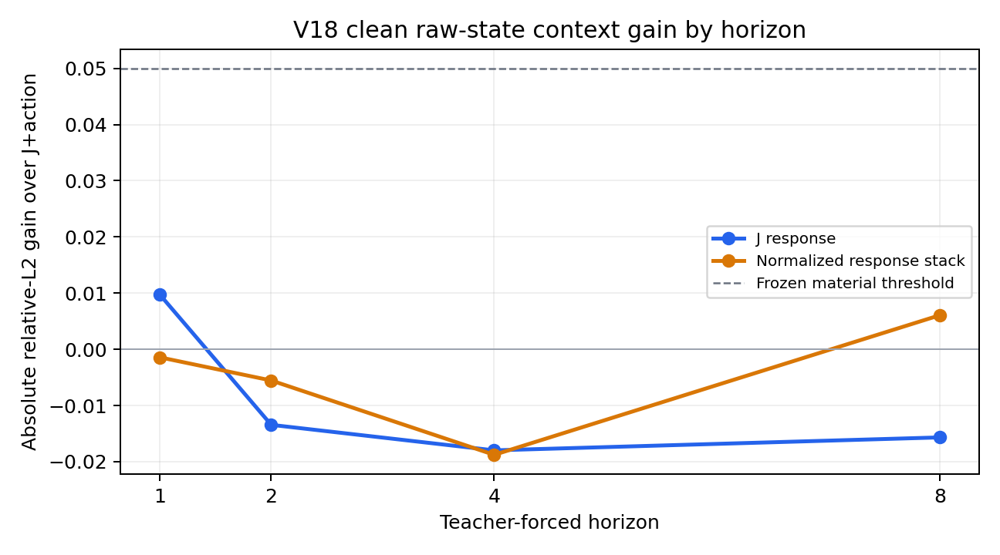

# V18 horizon context localization

The same frozen state/action panel is teacher-forced to h=1,2,4,8. Gains below are absolute relative-L2 reduction from J+action to J+full clean raw+action.

| h | J-only J rel-L2 | full-raw J rel-L2 | J-only stack rel-L2 | full-raw stack rel-L2 |
|---|---|---|---|---|
| 1 | 0.6513 | 0.6415 | 0.7206 | 0.7221 |
| 2 | 0.9223 | 0.9357 | 0.7434 | 0.7490 |
| 4 | 0.9487 | 0.9667 | 0.8190 | 0.8378 |
| 8 | 1.6173 | 1.6330 | 0.9745 | 0.9684 |

| h | J gain | stack gain | J CI95 | stack CI95 | material gate |
|---|---|---|---|---|---|
| 1 | 0.0098 | -0.0014 | [-0.02433933108748932, 0.04273443207294582] | [-0.022308355217209093, 0.017976869026094338] | False |
| 2 | -0.0134 | -0.0055 | [-0.030098967489423468, 0.003734300160781219] | [-0.027626948876160705, 0.017606735230390892] | False |
| 4 | -0.0180 | -0.0188 | [-0.046810982455770485, 0.008362779182922882] | [-0.045117018590196935, 0.0026789503207985134] | False |
| 8 | -0.0157 | 0.0061 | [-0.10308213072353574, 0.07053287254295897] | [-0.013925477354478615, 0.02464451948822157] | False |

Earliest horizon passing the pre-frozen joint target, bootstrap and family gate: **None**.
At long horizon, both models have high prediction error; absence of incremental raw gain here is not evidence that model memory is causally irrelevant. These are intervention-response prediction results, not autonomous transition evidence.
