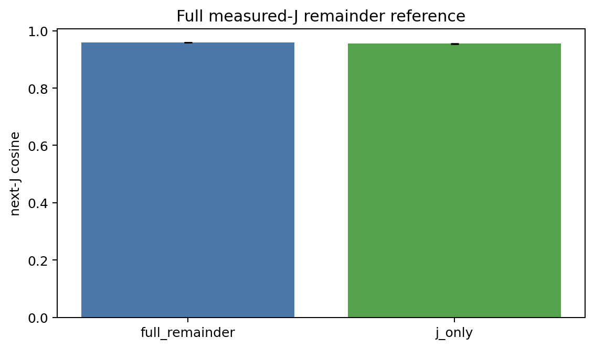
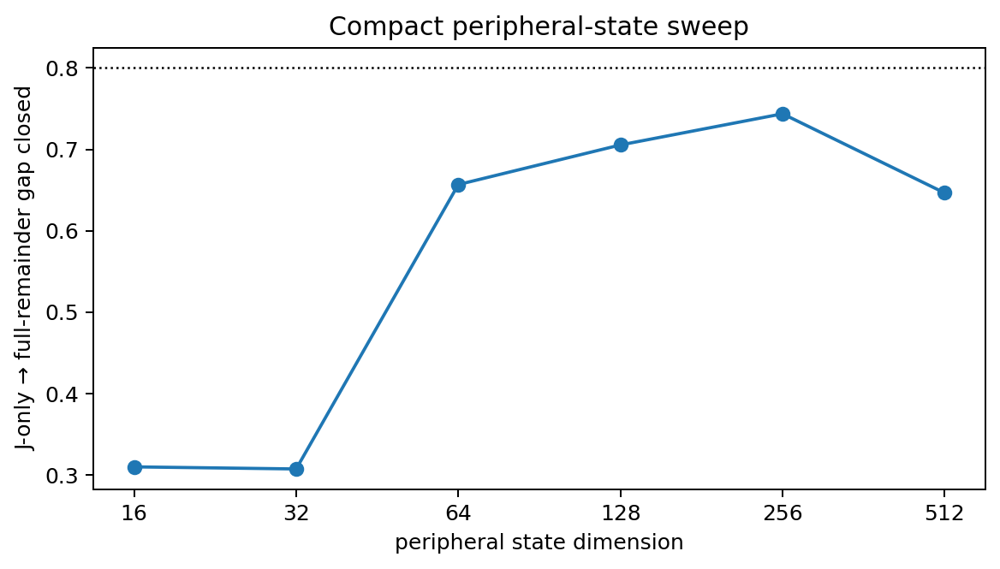
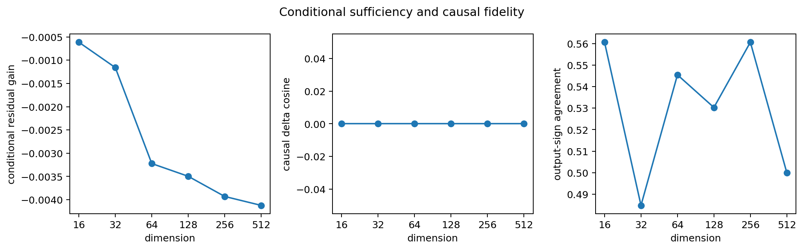
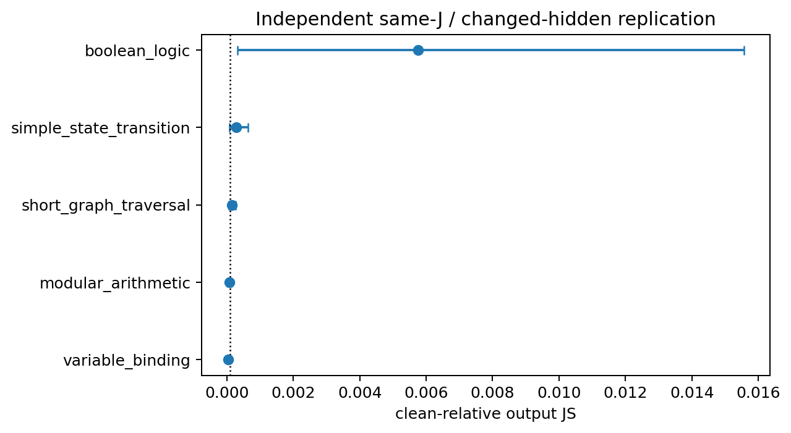

# Peripheral Computation State v5

## Material Passport

- Origin Skill: `academic-research-suite / experiment-agent`
- Mode: causal-predictive experiment execution
- Protocol: `jstate_peripheral_protocol_v5`
- Freeze digest: `de3e902d1382d475bbd26092a2f52b39587defafb7e8face0144bbbfcd521130`
- State definition: layer-23 normalized 4,096-concept measured-J plus a train-fitted measured-J remainder
- Verification status: machine results loaded from frozen, hash-verified records

## Result in one sentence

H2 remains the strongest operational interpretation: independent families show same-J/changed-hidden effects, but no complete compact recurrent system is established.

The full-remainder next-J cosine gain was **0.003688 [0.002816, 0.004546]**. Full-remainder ceiling authorization was **False**. The independent H2 arm completed **66** paired base trials; families above the frozen JS noise floor were `boolean_logic`.

## Full-remainder reference

The operational remainder is `standardized hidden state minus train-fitted rank-512 J-to-hidden prediction`. It is a train-fitted measured-J remainder, not a proof of the exact mathematical non-J complement. Selection used validation only; the table below is from the held-out rollout-test split and three frozen confirmation seeds.

| family                  | cosine gain (95% CI)            |   action accuracy gain |   transitions |   trajectories×seeds |
|:------------------------|:--------------------------------|-----------------------:|--------------:|---------------------:|
| pooled                  | 0.003688 [0.002816, 0.004546]   |              -0.025694 |          8640 |                  579 |
| boolean_logic           | -0.000277 [-0.000787, 0.000262] |              -0.023889 |          1800 |                  120 |
| modular_arithmetic      | 0.010934 [0.009314, 0.012496]   |              -0.047222 |          1440 |                   99 |
| short_graph_traversal   | 0.002119 [-0.000553, 0.004743]  |              -0.050000 |          1800 |                  120 |
| simple_state_transition | 0.007980 [0.006728, 0.009169]   |              -0.014444 |          1800 |                  120 |
| variable_binding        | -0.000866 [-0.002042, 0.000273] |               0.002778 |          1800 |                  120 |

## Compact peripheral-state sweep

|   dimension | encoder               |   next-J cosine |   semantic accuracy |   gap closed |   conditional gain |   causal cosine |    causal magnitude |   output sign | authorized   |   parameters |
|------------:|:----------------------|----------------:|--------------------:|-------------:|-------------------:|----------------:|--------------------:|--------------:|:-------------|-------------:|
|          16 | predictive_bottleneck |        0.956210 |            0.633681 |     0.309995 |          -0.000614 |        0.000000 | 112986103808.000000 |      0.560606 | False        |      5321760 |
|          32 | nonlinear_bottleneck  |        0.956200 |            0.623611 |     0.307442 |          -0.001159 |        0.000000 |  71002832896.000000 |      0.484848 | False        |      7007280 |
|          64 | predictive_bottleneck |        0.957489 |            0.642708 |     0.656773 |          -0.003223 |        0.000000 | 145649238016.000000 |      0.545455 | False        |      5469264 |
|         128 | predictive_bottleneck |        0.957668 |            0.628472 |     0.705449 |          -0.003497 |        0.000000 | 137724461056.000000 |      0.530303 | False        |      5665936 |
|         256 | predictive_bottleneck |        0.957810 |            0.627778 |     0.743718 |          -0.003931 |        0.000000 | 124905938944.000000 |      0.560606 | False        |      6059280 |
|         512 | predictive_bottleneck |        0.957451 |            0.621875 |     0.646478 |          -0.004122 |        0.000000 | 122801373184.000000 |      0.500000 | False        |      6845968 |

No tested 16–512D candidate passed the frozen gap, conditional-residual, and causal-fidelity gates together.

Trajectory summaries in the saved records are explicitly teacher-current one-step aggregates. They are not autonomous rollouts.

## Independent family-wise H2 replication

| family                  |   valid | output JS (95% CI)            | future-J divergence (95% CI)   | above frozen noise   |
|:------------------------|--------:|:------------------------------|:-------------------------------|:---------------------|
| boolean_logic           |      24 | 0.005749 [0.000325, 0.015569] | 0.005483 [0.000001, 0.015496]  | True                 |
| modular_arithmetic      |      12 | 0.000074 [0.000030, 0.000137] | 0.000001 [0.000000, 0.000001]  | False                |
| pooled                  |      66 | 0.002166 [0.000181, 0.005774] | 0.002331 [0.000001, 0.005981]  | False                |
| short_graph_traversal   |      12 | 0.000153 [0.000067, 0.000256] | 0.000001 [0.000000, 0.000001]  | False                |
| simple_state_transition |       6 | 0.000285 [0.000084, 0.000642] | 0.003705 [0.000001, 0.011114]  | False                |
| variable_binding        |      12 | 0.000047 [0.000017, 0.000084] | 0.000001 [0.000000, 0.000001]  | False                |

Mediation authorization was **True**. A later-J persistent-restoration analysis is interpreted only when a family-wise single-arm lower CI exceeds the frozen `1e-4` JS floor.

## Recurrent controller and autonomous rollout

Autonomous recurrence status: GATED_NOT_AUTHORIZED; the frozen compact-state authorization gate prevented interpretation.

## Answers to the twelve preregistered questions

1. **Does full remainder improve next-J prediction?** The paired cosine gain was 0.003688 [0.002816, 0.004546]; formal authorization was `False`.
2. **Which task families improve?** See the family-wise full-reference table; pooled results are not substituted for heterogeneous families.
3. **Can peripheral information be compressed?** No tested 16–512D candidate passed the frozen gap, conditional-residual, and causal-fidelity gates together.
4. **Smallest effective C_t?** None authorized.
5. **How much of the gap is closed?** The selected-by-dimension values are reported in the compact table without post-hoc threshold changes.
6. **Does residual R_t add value after C_t?** The `conditional gain` column measures the held-out gain from a PCA-256 summary of residual `(R_t | C_t)`.
7. **Does C_t have intervention fidelity?** The causal cosine, magnitude ratio, semantic-delta agreement, and output-sign agreement are stored pooled and by family; authorization requires the frozen direction/sign criteria.
8. **Does H2 replicate family-wise?** Families exceeding the frozen causal noise rule: `boolean_logic`.
9. **Is (J_t,C_t) approximately sufficient?** `False` under the operational, finite-dictionary state and frozen v5 gates; this is not a claim of exact sufficiency.
10. **Can a recurrent controller maintain C_t?** Autonomous recurrence status: GATED_NOT_AUTHORIZED; the frozen compact-state authorization gate prevented interpretation.
11. **How long is autonomous rollout stable?** Horizon-wise values are reported only if recurrence was authorized and executed; teacher-current prediction is never relabeled autonomous.
12. **Is there a compact effective high-level dynamical system?** H2 remains the strongest operational interpretation: independent families show same-J/changed-hidden effects, but no complete compact recurrent system is established.

## Evidence boundaries and alternative explanations

- H2 replication and intervention fidelity use interventions; the ceiling, compression, and conditional tests are predictive/associational.
- A positive prediction gain does not establish causal sufficiency. A PCA success alone is not labeled a peripheral causal state.
- A weak full-remainder ceiling gates compact-state interpretation rather than turning compact-model failure into evidence for J sufficiency.
- Family heterogeneity is retained. The report does not infer all families from a pooled mean.
- All representation fitting and model selection use train/validation data; rollout-test and the independent causal split are held out.
- Teacher-current trajectory aggregates and autonomous recurrence are explicitly separated.
- The dictionary-limited measured-J remainder is not described as the complete non-J space.
- Failed/invalid causal attempts remain in raw records and valid counts are reported.
- Frozen thresholds are not lowered after observing results.
- Confidence intervals quantify sampling uncertainty; they do not remove model, task, intervention, or measurement uncertainty.
- No result is interpreted as consciousness, extracted true thoughts, or parameter-level physical modularity.

## Provenance

Every plotted series is regenerated from saved JSON/Parquet records. Figure sidecars contain source paths and SHA-256 hashes. Model checkpoints, hidden tensors, and causal state tensors remain uncommitted artifacts referenced by hashes.

<!-- PERIPHERAL_V5_POSTRUN_START -->

## Post-run numerical and family-wise audit

This audit does not revise the frozen v5 protocol or rerun any formal trial.
The causal-fidelity source stored next-J profiles as `float16`.
Of 66 paired interventions,
64 had an exactly zero saved teacher next-J delta;
the median norm was 0 and only
2 were nonzero. Direction cosine and magnitude
ratio are therefore **not numerically evaluable** for this endpoint. The
reported output-sign and semantic-change agreements remain descriptive, but
cannot authorize a causal peripheral state.

### Family-wise compact diagnostics

|   dimension | encoder               | family                  |   next-J cosine |   semantic accuracy |   conditional gain |   causal cosine |   output-sign agreement |   transitions |
|------------:|:----------------------|:------------------------|----------------:|--------------------:|-------------------:|----------------:|------------------------:|--------------:|
|          16 | predictive_bottleneck | boolean_logic           |        0.965697 |            0.546667 |          -0.003321 |        0.000000 |                0.541667 |           600 |
|          16 | predictive_bottleneck | modular_arithmetic      |        0.964306 |            0.881250 |           0.006715 |        0.000000 |                0.500000 |           480 |
|          16 | predictive_bottleneck | short_graph_traversal   |        0.954433 |            0.631667 |          -0.005103 |        0.000000 |                0.583333 |           600 |
|          16 | predictive_bottleneck | simple_state_transition |        0.973549 |            0.930000 |           0.000941 |        0.000000 |                0.333333 |           600 |
|          16 | predictive_bottleneck | variable_binding        |        0.924683 |            0.228333 |          -0.000835 |        0.000000 |                0.750000 |           600 |
|          32 | nonlinear_bottleneck  | boolean_logic           |        0.965419 |            0.541667 |          -0.002760 |        0.000000 |                0.583333 |           600 |
|          32 | nonlinear_bottleneck  | modular_arithmetic      |        0.964866 |            0.889583 |           0.005529 |        0.000000 |                0.416667 |           480 |
|          32 | nonlinear_bottleneck  | short_graph_traversal   |        0.951405 |            0.593333 |          -0.002193 |        0.000000 |                0.416667 |           600 |
|          32 | nonlinear_bottleneck  | simple_state_transition |        0.975207 |            0.936667 |          -0.002510 |        0.000000 |                0.333333 |           600 |
|          32 | nonlinear_bottleneck  | variable_binding        |        0.925838 |            0.210000 |          -0.002524 |        0.000000 |                0.500000 |           600 |
|          64 | predictive_bottleneck | boolean_logic           |        0.965265 |            0.546667 |          -0.002008 |        0.000000 |                0.458333 |           600 |
|          64 | predictive_bottleneck | modular_arithmetic      |        0.968351 |            0.893750 |          -0.001212 |        0.000000 |                0.500000 |           480 |
|          64 | predictive_bottleneck | short_graph_traversal   |        0.954851 |            0.661667 |          -0.005600 |        0.000000 |                0.666667 |           600 |
|          64 | predictive_bottleneck | simple_state_transition |        0.975392 |            0.935000 |          -0.003291 |        0.000000 |                0.500000 |           600 |
|          64 | predictive_bottleneck | variable_binding        |        0.925756 |            0.226667 |          -0.003602 |        0.000000 |                0.666667 |           600 |
|         128 | predictive_bottleneck | boolean_logic           |        0.965742 |            0.551667 |          -0.000991 |        0.000000 |                0.708333 |           600 |
|         128 | predictive_bottleneck | modular_arithmetic      |        0.969254 |            0.881250 |          -0.002320 |        0.000000 |                0.583333 |           480 |
|         128 | predictive_bottleneck | short_graph_traversal   |        0.954245 |            0.633333 |          -0.005921 |        0.000000 |                0.333333 |           600 |
|         128 | predictive_bottleneck | simple_state_transition |        0.975377 |            0.921667 |          -0.002896 |        0.000000 |                0.333333 |           600 |
|         128 | predictive_bottleneck | variable_binding        |        0.926041 |            0.205000 |          -0.005122 |        0.000000 |                0.416667 |           600 |
|         256 | predictive_bottleneck | boolean_logic           |        0.966109 |            0.538333 |          -0.001202 |        0.000000 |                0.625000 |           600 |
|         256 | predictive_bottleneck | modular_arithmetic      |        0.970556 |            0.881250 |          -0.001671 |        0.000000 |                0.416667 |           480 |
|         256 | predictive_bottleneck | short_graph_traversal   |        0.953861 |            0.611667 |          -0.007019 |        0.000000 |                0.583333 |           600 |
|         256 | predictive_bottleneck | simple_state_transition |        0.975546 |            0.936667 |          -0.003840 |        0.000000 |                0.500000 |           600 |
|         256 | predictive_bottleneck | variable_binding        |        0.925525 |            0.221667 |          -0.005470 |        0.000000 |                0.583333 |           600 |
|         512 | predictive_bottleneck | boolean_logic           |        0.965700 |            0.536667 |          -0.000269 |        0.000000 |                0.541667 |           600 |
|         512 | predictive_bottleneck | modular_arithmetic      |        0.969978 |            0.877083 |          -0.000901 |        0.000000 |                0.500000 |           480 |
|         512 | predictive_bottleneck | short_graph_traversal   |        0.953713 |            0.600000 |          -0.011395 |        0.000000 |                0.500000 |           600 |
|         512 | predictive_bottleneck | simple_state_transition |        0.975455 |            0.938333 |          -0.003072 |        0.000000 |                0.166667 |           600 |
|         512 | predictive_bottleneck | variable_binding        |        0.924914 |            0.208333 |          -0.004330 |        0.000000 |                0.583333 |           600 |

These are predictive results except for the intervention-fidelity columns.
Negative conditional gains show that the augmented model did not learn to use
the added residual summary; they do not prove that the residual contains no
information.

### Single-arm and persistent-restoration comparison

All 66 accepted J-preserving interventions passed the frozen state-equality
criteria. Dense cosine had median 1.000000000
(minimum 0.999999881); top-10 overlap had median
1.000; RMS drift had median
0.000000; displacement was
0.250 natural-difference units at
the median.

| condition         | output JS (95% CI)             | future-J divergence           | target log-odds change           |   answer flip rate |   task accuracy change |
|:------------------|:-------------------------------|:------------------------------|:---------------------------------|-------------------:|-----------------------:|
| clean             | 0.000000 [-0.000000, 0.000000] | 0.000000 [0.000000, 0.000000] | 0.000000 [0.000000, 0.000000]    |           0.000000 |               0.000000 |
| full_perturbation | 0.008294 [0.002890, 0.015263]  | 0.010484 [0.004953, 0.017406] | -0.093466 [-0.222422, 0.022433]  |           0.030303 |              -0.090909 |
| identity          | 0.000000 [-0.000000, 0.000000] | 0.000000 [0.000000, 0.000000] | 0.000000 [0.000000, 0.000000]    |           0.000000 |               0.000000 |
| j_positive        | 0.018206 [0.008791, 0.029538]  | 0.061762 [0.049174, 0.075593] | -0.381633 [-0.615970, -0.176074] |           0.075758 |              -0.136364 |
| j_preserving      | 0.002166 [0.000181, 0.005774]  | 0.002331 [0.000001, 0.005981] | 0.000030 [-0.058075, 0.082932]   |           0.015152 |              -0.045455 |
| matched_random    | 0.006112 [0.000271, 0.013539]  | 0.007843 [0.002643, 0.014466] | -0.051708 [-0.198814, 0.073915]  |           0.045455 |              -0.045455 |

| family                  | single JS (95% CI)            | persistent-final JS           | persistent-all JS             |   M_final point |   M_all point |
|:------------------------|:------------------------------|:------------------------------|:------------------------------|----------------:|--------------:|
| boolean_logic           | 0.005749 [0.000325, 0.015569] | 0.015476 [0.000026, 0.041746] | 0.015476 [0.000026, 0.041746] |       -1.691871 |     -1.691871 |
| modular_arithmetic      | 0.000074 [0.000030, 0.000137] | 0.000003 [0.000001, 0.000006] | 0.000003 [0.000001, 0.000006] |        0.953152 |      0.953152 |
| pooled                  | 0.002166 [0.000181, 0.005774] | 0.007016 [0.000158, 0.016881] | 0.007016 [0.000158, 0.016881] |       -2.238962 |     -2.238962 |
| short_graph_traversal   | 0.000153 [0.000067, 0.000256] | 0.000015 [0.000007, 0.000025] | 0.000015 [0.000007, 0.000025] |        0.900255 |      0.900255 |
| simple_state_transition | 0.000285 [0.000084, 0.000642] | 0.015224 [0.000217, 0.042327] | 0.015224 [0.000217, 0.042327] |      -52.392699 |    -52.392699 |
| variable_binding        | 0.000047 [0.000017, 0.000084] | 0.000007 [0.000003, 0.000013] | 0.000007 [0.000003, 0.000013] |        0.843785 |      0.843785 |

The persistent-final and persistent-all estimates are identical in this
final-token arm, but both exceed the single-arm point estimate overall and in
the Boolean family. Thus v5 does not demonstrate mediation removal. The
restoration operation may itself alter later dynamics; without a
persistent-identity/null arm this result cannot distinguish bypass from a
restoration artifact.

### Determinism and execution boundary

PyTorch reported that the memory-efficient attention backward kernel was not
strictly deterministic during the attention-reference screen. Confirmation
used the three frozen seeds, and the observed limitation is retained rather
than hidden by an effect-dependent retry. No compact state passed all frozen
gates, so recurrent training was correctly recorded as
`GATED_NOT_AUTHORIZED` and autonomous rollout was not executed.

<!-- PERIPHERAL_V5_POSTRUN_END -->
